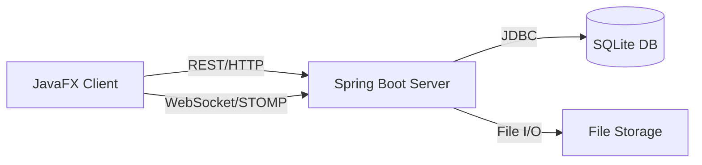

# 🌟 **Collab Study Platform — Enhanced Documentation**

A modern **client–server desktop application** designed to make group studying organized, interactive, and convenient. This document provides a polished, structured overview of the system, its architecture, components, and development insights.

---

## 🎯 **1. Project Overview & Goals**

**Collab Study Platform** helps students collaborate efficiently by combining communication, task tracking, and resource sharing in one place.

### **Key Objectives:**
- Create and manage study groups effortlessly.
- Provide **real-time chat** and instant notifications.
- Support team productivity with **task management** and **file sharing**.
- Ensure a smooth desktop experience using **JavaFX** and a robust backend.

---

## 🏗️ **2. System Architecture**

The solution follows a clean **three-tier architecture**, ensuring scalability and modularity.

### **1. Frontend (JavaFX Client)**
- Interactive GUI for students.
- Communicates with backend via **REST API** and **WebSocket/STOMP**.
- Stores auth tokens in an in-memory `SessionStore`.

### **2. Backend (Spring Boot Server)**
- Handles authentication, business logic, and authorization.
- Hosts REST endpoints and a WebSocket broker.
- Saves uploaded files to local storage.

### **3. Database (SQLite)**
- Lightweight relational database (`app.db`).
- Stores persistent entities: users, groups, tasks, messages, etc.

### **Architecture Diagram**

---

## 🗄️ **3. Database Model (ER Diagram)**

The data model supports clear relationships between users, groups, and resources.

### **Main Tables:**
- **users** — credentials, profile info, Google OAuth IDs.
- **groups** — study groups with owners.
- **memberships** — M:N relations between users and groups.
- **conversations & messages** — chat system structure.
- **tasks & task_progress** — task states per user.
- **resources** — metadata of uploaded study materials.

---

## 🔌 **4. API Documentation**

### **REST Endpoints**

#### 🔐 Authentication
- `POST /api/auth/login` — user login (returns token).
- `POST /api/auth/register` — register new user.
- `GET /api/auth/oauth2/success` — exchange Google session for app token.

#### 👥 Groups & Tasks
- `GET /api/groups` — fetch user groups.
- `POST /api/groups` — create a group.
- `GET /api/groups/{id}/tasks` — load tasks.
- `POST /api/tasks` — create task.
- `PATCH /api/tasks/{id}/progress` — update progress.

#### 💬 Chat
- `GET /api/chat/conversations/of-user/{id}` — list conversations.
- `GET /api/chat/{id}/messages` — fetch message history.

#### 📁 Materials
- `POST /api/groups/{id}/resources` — upload file (Multipart).
- `GET /api/resources/{id}/download` — download resource.

---

### **WebSocket (STOMP)**
**Endpoint:** `ws://localhost:8080/ws`

#### Subscriptions
- `/topic/conversations/{id}` — real-time messages.
- `/topic/groups/{id}/tasks` — live task updates.

#### Send
- `/app/chat.sendMessage` — send chat message.

---

## 🖼️ **5. User Interface (Overview)**
- **Login/Registration** — includes Google OAuth.
- **Dashboard** — orbital-style navigation.
- **Chat View** — real-time messaging.
- **Group Management** — members and resources.
- **Task Board** — track and update group tasks.

---

## ⚙️ **6. Development Challenges & Solutions**

### 🔐 Google OAuth in JavaFX
**Problem:** Google blocks WebView as an insecure browser.

**Solution:**
- Spoofed User-Agent to mimic modern Chrome/Edge.
- Used `CookieManager` to transfer auth session to REST client.

---

### 🔄 Syncing REST and WebSocket
**Challenge:** Secure WebSocket communication with simple tokens.

**Solution:**
- REST used for history & file handling.
- WebSocket handles **only real-time events**.

---

### 🐳 Deployment & CI/CD
**Problems:** Incorrect Java images and large Git pushes.

**Solutions:**
- Multi-stage Docker build using `eclipse-temurin:21`.
- Clean `.gitignore` for build artifacts.

---

## 🤖 **7. AI Involvement & Evaluation**

### ⭐ What AI Helped With
- Boilerplate JavaFX controllers & FXML.
- SQL schema generation.
- Debugging OAuth, 401 errors, module issues.
- Dockerfile + GitHub Actions setup.

### 🛠️ What Required Manual Effort
- Controller communication & scene management.
- Simplifying Spring Security suggestions.
- Custom UI/UX styling beyond generic AI output.

---

## ✍️ **Author**
**Melnyk Maksym & Semak Mikhailo**
